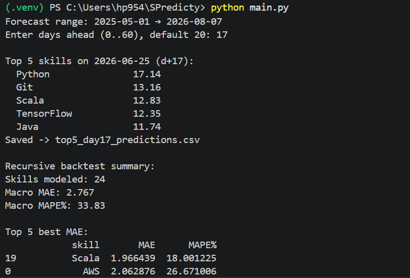
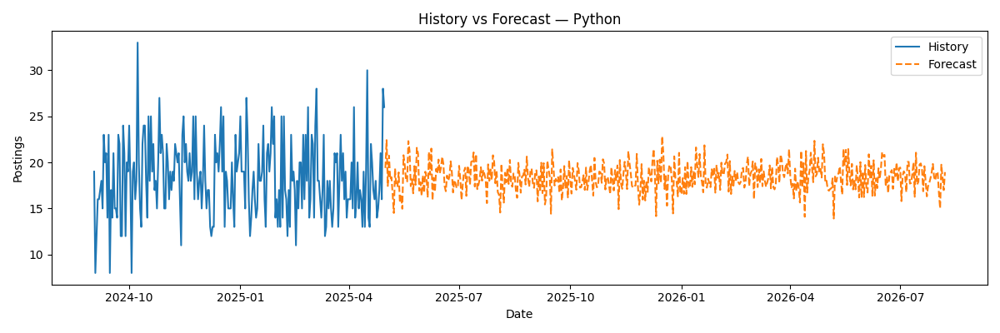

# SPredicty

SPredicty is a machine learning-based skill demand forecasting system that analyzes historical AI job posting data and predicts future demand for technical skills.

The project transforms job posting records into time-series skill trends and uses LightGBM forecasting models to identify the most in-demand skills for future time horizons.

---

## Features

- AI skill demand forecasting
- Time-series feature engineering
- Recursive forecasting
- Direct horizon forecasting
- Top skill ranking system
- Forecast visualization
- Performance evaluation using MAE and MAPE
- CSV export of predictions and metrics

---

## Project Workflow

1. Load and merge job posting datasets
2. Extract skills from job descriptions
3. Generate daily skill demand counts
4. Create time-series forecasting features
5. Train LightGBM forecasting models
6. Evaluate model performance
7. Forecast future skill demand
8. Rank top predicted skills
9. Visualize trends and forecasts

---

## Technologies Used

- Python
- Pandas
- NumPy
- LightGBM
- Scikit-Learn
- Matplotlib

---

## Forecasting Techniques

### Recursive Forecasting

A one-step forecasting model predicts future values recursively by feeding previous predictions back into the model.

### Direct Forecasting

Separate models are trained for multiple forecasting horizons:

- 1 Day
- 7 Days
- 14 Days
- 30 Days
- 60 Days

---

## Evaluation Metrics

The system evaluates forecasting performance using:

- Mean Absolute Error (MAE)
- Mean Absolute Percentage Error (MAPE)

---

## Example Output

Enter days ahead (0..60), default 20: 17

Top 5 skills on 2026-06-25 (d+17)

Python       17.14
Git          13.16
Scala        12.83
TensorFlow   12.35
Java         11.74

---

## Screenshots

### Top 5 Skills Prediction


### Forecast Visualization


---

## Project Structure
```text
SPredicty/
│
├── data/
│   ├── ai_job_dataset.csv
│   └── ai_job_dataset1.csv
│
├── outputs/
│   ├── skill_backtest_recursive_metrics.csv
│   ├── skill_direct_horizon_metrics.csv
│   └── top5_day17_predictions.csv
│
├── screenshots/
│   ├── Bar_chart.png
│   ├── History_vs_Forecast.png
│   ├── Metrics_summary.png
│   ├── output_files.jpeg
│   └── Top_5_skills_output.png
│
├── main.py
├── requirements.txt
├── README.md
└── .gitignore
```

---

Dataset Source:
Global AI Job Market & Salary Trends 2025
https://www.kaggle.com/datasets/bismasajjad/global-ai-job-market-and-salary-trends-2025
License: CC0 (Public Domain)

---

## Future Improvements

- Real-time job market data integration
- Automated job scraping pipelines
- Streamlit web application
- Interactive dashboard
- Emerging skill detection
- Regional demand forecasting
- Salary trend analysis

---

## Author
Krish